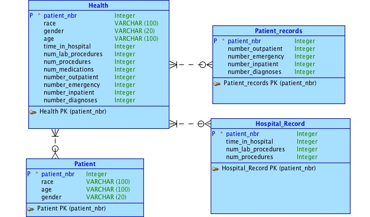
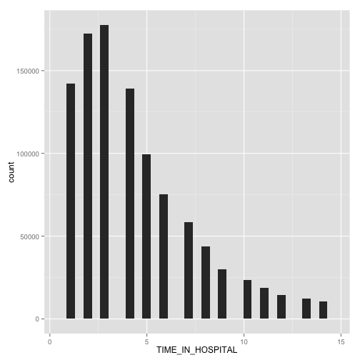
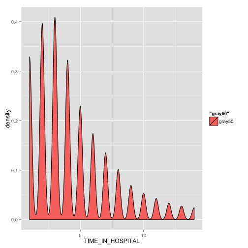
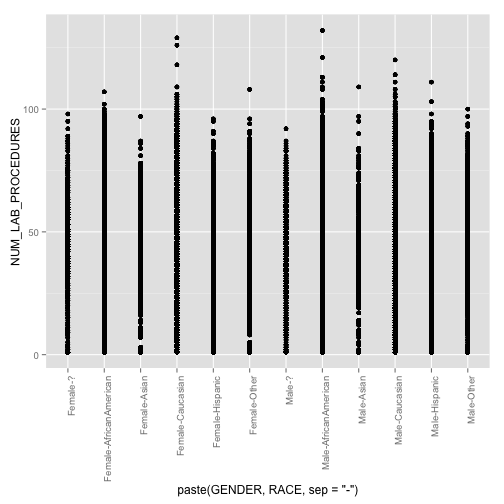
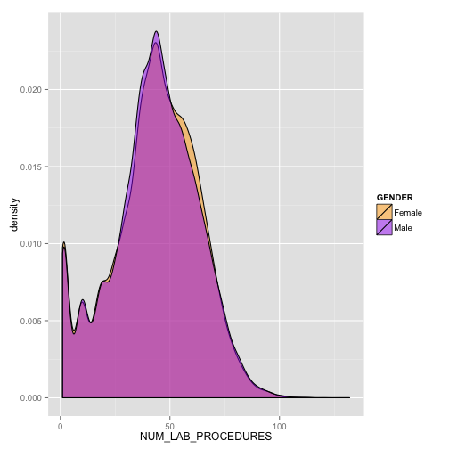

Data Science Fall 2014 Health Project
===
**This project analyzes the Health data from the ggplot2 package which has been supplemented with additional synthetic data and stored in an Oracle database.**

###This is how my RStudio is configured:

```r
sessionInfo()
```

```
## R version 3.0.3 (2014-03-06)
## Platform: x86_64-apple-darwin10.8.0 (64-bit)
## 
## locale:
## [1] en_US.UTF-8/en_US.UTF-8/en_US.UTF-8/C/en_US.UTF-8/en_US.UTF-8
## 
## attached base packages:
## [1] graphics  grDevices utils     datasets  stats     methods   base     
## 
## other attached packages:
## [1] lubridate_1.3.3 RJDBC_0.2-4     rJava_0.9-6     DBI_0.2-7      
## [5] ggplot2_1.0.0  
## 
## loaded via a namespace (and not attached):
##  [1] colorspace_1.2-4 digest_0.6.4     evaluate_0.5.5   formatR_1.0     
##  [5] grid_3.0.3       gtable_0.1.2     knitr_1.6        labeling_0.3    
##  [9] markdown_0.7.4   MASS_7.3-29      memoise_0.2.1    mime_0.1.2      
## [13] munsell_0.4.2    plyr_1.8.1       proto_0.3-10     Rcpp_0.11.2     
## [17] reshape2_1.4     scales_0.2.4     stringr_0.6.2    tools_3.0.3
```

###These are the packages I load from .Rprofile:

```r
# To get this to work in your environment, change the following directory/folder path to the path to your project files.
setwd("/Users/ljs1988/Desktop/health")
system("cat .Rprofile", intern = TRUE)
```

```
## [1] "library(\"ggplot2\", lib.loc=\"/Library/Frameworks/R.framework/Versions/3.0/Resources/library\")"  
## [2] "library(\"gplots\", lib.loc=\"/Library/Frameworks/R.framework/Versions/3.0/Resources/library\")"   
## [3] "library(\"DBI\", lib.loc=\"/Library/Frameworks/R.framework/Versions/3.0/Resources/library\")   "   
## [4] "library(\"rJava\", lib.loc=\"/Library/Frameworks/R.framework/Versions/3.0/Resources/library\")    "
## [5] "library(\"RJDBC\", lib.loc=\"/Library/Frameworks/R.framework/Versions/3.0/Resources/library\")    "
## [6] "library(\"plyr\", lib.loc=\"/Library/Frameworks/R.framework/Versions/3.0/Resources/library\")  "   
## [7] "library(\"tabplot\", lib.loc=\"/Library/Frameworks/R.framework/Versions/3.0/Resources/library\") " 
## [8] "library(\"lubridate\", lib.loc=\"/Library/Frameworks/R.framework/Versions/3.0/Resources/library\")"
```

###Health Data Model

  

###Health Data 

####Health.ddl 


```r
# To get this to work in your environment, change the following directory/folder path to the path to your project files.
setwd("/Users/ljs1988/Desktop/health/02HealthData")
system("cat Health.ddl", intern = TRUE)
```

```
##  [1] "drop table health;"                                                            
##  [2] ""                                                                              
##  [3] "create table health "                                                          
##  [4] " ("                                                                            
##  [5] " patient_nbr integer,"                                                         
##  [6] " race varchar(100),"                                                           
##  [7] " gender varchar(20),"                                                          
##  [8] " age varchar(50),"                                                             
##  [9] " time_in_hospital integer,"                                                    
## [10] " num_lab_procedures integer,"                                                  
## [11] " num_procedures integer,"                                                      
## [12] " num_medications integer,"                                                     
## [13] " number_outpatient integer,"                                                   
## [14] " number_emergency integer,"                                                    
## [15] " number_inpatient integer,"                                                    
## [16] " number_diagnoses integer"                                                     
## [17] " );"                                                                           
## [18] ""                                                                              
## [19] " ALTER TABLE health ADD CONSTRAINT health_PK PRIMARY KEY ( \"patient_nbr\" ) ;"
```

####First few rows of Diamonds.dml


```r
# To get this to work in your environment, change the following directory/folder path to the path to your project files.
setwd("/Users/ljs1988/Desktop/health/02HealthData")
system("head Health.dml.head", intern = TRUE)
```

```
##  [1] "INSERT INTO health(patient_nbr,race,gender,age,time_in_hospital,num_lab_procedures,num_procedures,num_medications,number_outpatient,number_emergency,number_inpatient,number_diagnoses) VALUES (8222157,'Caucasian','Female','[0-10)',1,41,0,1,0,0,0,1);"         
##  [2] "INSERT INTO health(patient_nbr,race,gender,age,time_in_hospital,num_lab_procedures,num_procedures,num_medications,number_outpatient,number_emergency,number_inpatient,number_diagnoses) VALUES (55629189,'Caucasian','Female','[10-20)',3,59,0,18,0,0,0,9);"      
##  [3] "INSERT INTO health(patient_nbr,race,gender,age,time_in_hospital,num_lab_procedures,num_procedures,num_medications,number_outpatient,number_emergency,number_inpatient,number_diagnoses) VALUES (86047875,'AfricanAmerican','Female','[20-30)',2,11,5,13,2,0,1,6);"
##  [4] "INSERT INTO health(patient_nbr,race,gender,age,time_in_hospital,num_lab_procedures,num_procedures,num_medications,number_outpatient,number_emergency,number_inpatient,number_diagnoses) VALUES (82442376,'Caucasian','Male','[30-40)',2,44,1,16,0,0,0,7);"        
##  [5] "INSERT INTO health(patient_nbr,race,gender,age,time_in_hospital,num_lab_procedures,num_procedures,num_medications,number_outpatient,number_emergency,number_inpatient,number_diagnoses) VALUES (42519267,'Caucasian','Male','[40-50)',1,51,0,8,0,0,0,5);"         
##  [6] "INSERT INTO health(patient_nbr,race,gender,age,time_in_hospital,num_lab_procedures,num_procedures,num_medications,number_outpatient,number_emergency,number_inpatient,number_diagnoses) VALUES (82637451,'Caucasian','Male','[50-60)',3,31,6,16,0,0,0,9);"        
##  [7] "INSERT INTO health(patient_nbr,race,gender,age,time_in_hospital,num_lab_procedures,num_procedures,num_medications,number_outpatient,number_emergency,number_inpatient,number_diagnoses) VALUES (84259809,'Caucasian','Male','[60-70)',4,70,1,21,0,0,0,7);"        
##  [8] "INSERT INTO health(patient_nbr,race,gender,age,time_in_hospital,num_lab_procedures,num_procedures,num_medications,number_outpatient,number_emergency,number_inpatient,number_diagnoses) VALUES (114882984,'Caucasian','Male','[70-80)',5,73,0,12,0,0,0,8);"       
##  [9] "INSERT INTO health(patient_nbr,race,gender,age,time_in_hospital,num_lab_procedures,num_procedures,num_medications,number_outpatient,number_emergency,number_inpatient,number_diagnoses) VALUES (48330783,'Caucasian','Female','[80-90)',13,68,2,28,0,0,0,8);"     
## [10] "INSERT INTO health(patient_nbr,race,gender,age,time_in_hospital,num_lab_procedures,num_procedures,num_medications,number_outpatient,number_emergency,number_inpatient,number_diagnoses) VALUES (63555939,'Caucasian','Female','[90-100)',12,33,3,18,0,0,0,8);"
```

####HealthRest.ddl 


```r
# To get this to work in your environment, change the following directory/folder path to the path to your project files.
setwd("/Users/ljs1988/Desktop/health/02HealthData/")
system("cat HealthRest.ddl", intern = TRUE)
```

```
##  [1] "drop table patient;"                                                                            
##  [2] ""                                                                                               
##  [3] "create table patient"                                                                           
##  [4] " ("                                                                                             
##  [5] " patient_nbr integer,"                                                                          
##  [6] " race varchar(100),"                                                                            
##  [7] " gender varchar(20),"                                                                           
##  [8] " age varchar(50),"                                                                              
##  [9] " );"                                                                                            
## [10] ""                                                                                               
## [11] " ALTER TABLE patient ADD CONSTRAINT patient_PK PRIMARY KEY ( \"patient_nbr\" ) ;"               
## [12] ""                                                                                               
## [13] "drop table hospital_record"                                                                     
## [14] ""                                                                                               
## [15] "create table hospital_record("                                                                  
## [16] " patient_nbr integer,"                                                                          
## [17] " time_in_hospital integer,"                                                                     
## [18] " num_lab_procedures integer,"                                                                   
## [19] " num_procedures integer,"                                                                       
## [20] ")"                                                                                              
## [21] "ALTER TABLE hospital_record ADD CONSTRAINT hospital_record_PK PRIMARY KEY ( \"patient_nbr\" ) ;"
## [22] ""                                                                                               
## [23] "drop table patient_records"                                                                     
## [24] ""                                                                                               
## [25] "create table patient_records"                                                                   
## [26] "("                                                                                              
## [27] " patient_nbr integer,"                                                                          
## [28] " num_medications integer,"                                                                      
## [29] " number_outpatient integer,"                                                                    
## [30] " number_emergency integer,"                                                                     
## [31] " number_inpatient integer,"                                                                     
## [32] " number_diagnoses integer"                                                                      
## [33] ")"                                                                                              
## [34] "ALTER TABLE patient_records ADD CONSTRAINT patient_records_PK PRIMARY KEY ( \"patient_nbr\" ) ;"
```


```r
source("../03Analysis/HealthAnalysis.R", echo = TRUE)
```

```
## 
## > library("ggplot2", lib.loc="/Library/Frameworks/R.framework/Versions/3.0/Resources/library")
## 
## > library("lubridate", lib.loc="/Library/Frameworks/R.framework/Versions/3.0/Resources/library")
## 
## > options(java.parameters="-Xmx2g")
## 
## > library(rJava)
## 
## > library(RJDBC)
## 
## > jdbcDriver <- JDBC(driverClass="oracle.jdbc.OracleDriver", classPath="/System/Library/Java/JavaVirtualMachines/1.6.0.jdk/Contents/Home/ojdbc6.jar")
## 
## > # In the following, use your username and password instead of "CS347_prof", "orcl_prof" once you have an Oracle account
## > possibleError <- tryCatch( .... [TRUNCATED] 
## 
## > if(!inherits(possibleError, "error")){
## +   healths <- dbGetQuery(jdbcConnection, "select race, num_lab_procedures, gender, age.age, age.time_in_hosp ..." ... [TRUNCATED] 
## [1] TRUE
## 
## > head(healths)
##              RACE NUM_LAB_PROCEDURES GENDER      AGE   ATH
## 1           Asian                 46 Female [90-100) 4.756
## 2       Caucasian                 53   Male [90-100) 4.756
## 3       Caucasian                 56   Male [90-100) 4.756
## 4 AfricanAmerican                 72   Male [90-100) 4.756
## 5 AfricanAmerican                 43 Female [90-100) 4.756
## 6 AfricanAmerican                 34 Female [90-100) 4.756
##   TIME_IN_HOSPITAL
## 1                6
## 2                4
## 3                3
## 4                3
## 5                5
## 6                7
## 
## > ggplot(healths, aes(TIME_IN_HOSPITAL)) + geom_histogram()
```

```
## stat_bin: binwidth defaulted to range/30. Use 'binwidth = x' to adjust this.
```

 

```
## 
## > ggplot(data = healths) + geom_density(aes(x = TIME_IN_HOSPITAL, fill = "gray50"))
```

 

```
## 
## > ggplot(healths, aes(x = AGE, y = NUM_LAB_PROCEDURES)) + geom_point()
```

 

```
## 
## > ggplot(subset(healths, AGE == "[20-30)" | AGE == "[70-80)"), aes(x = AGE, y = NUM_LAB_PROCEDURES)) + geom_point()
```

 

```
## 
## > ggplot(subset(healths, GENDER == "Male" | GENDER == "Female"), aes(x = paste(GENDER, RACE, sep='-'), y = NUM_LAB_PROCEDURES)) + 
## +   geom_point() +  .... [TRUNCATED]
```

 

```
## 
## > head(healths2)
##   GENDER NUM_LAB_PROCEDURES
## 1 Female                 46
## 2   Male                 53
## 3   Male                 56
## 4   Male                 72
## 5 Female                 43
## 6 Female                 34
## 
## > ggplot(healths2, aes(NUM_LAB_PROCEDURES, fill=GENDER)) + 
## +   geom_density(alpha=.5) + scale_fill_manual(values = c("orange", "purple"))
```

 
